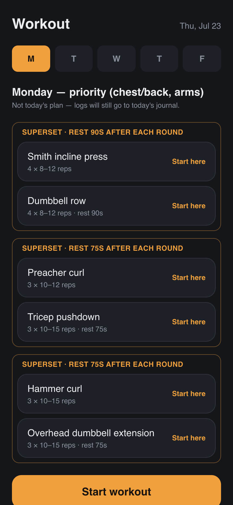
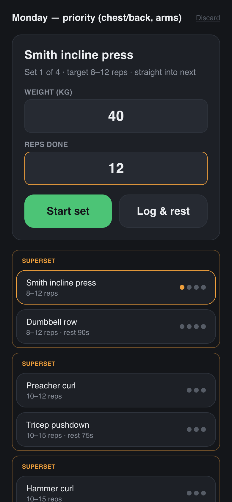
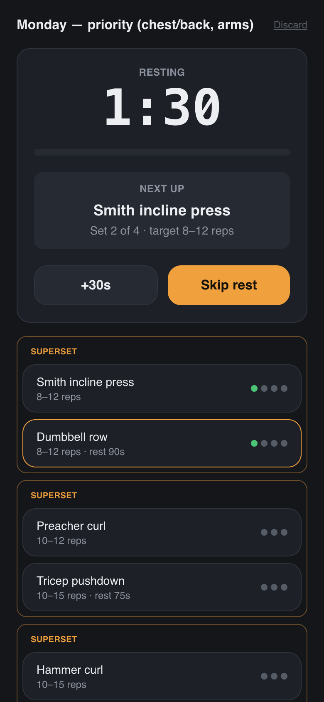
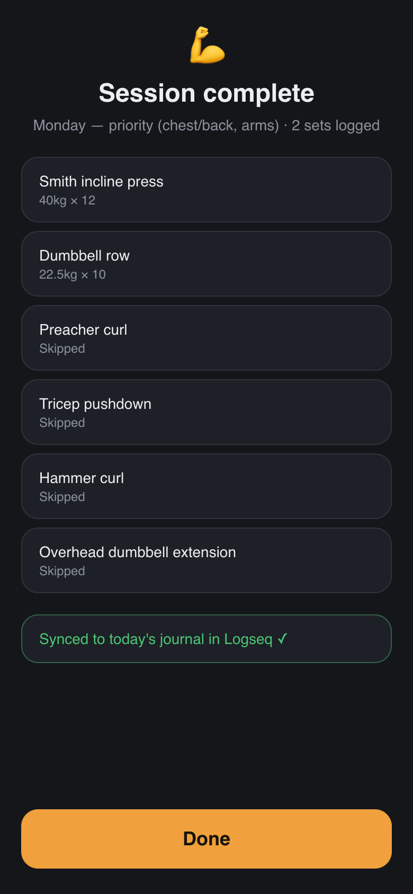

# logseq-workout-pwa

Mobile-first PWA that guides a fixed weekly gym plan set by set — weight and
reps inputs, rest timer with sound/vibration, screen wake lock, superset
support — and appends each finished session as a `#Workout`-tagged markdown
table to the today journal page of a Logseq DB graph.

Built on the sidecar pattern from `logseq-todo-pwa` (see its
`SIDECAR_ARCHITECTURE.md`): a small Bun HTTP server shells out to the `logseq`
CLI; the browser only ever talks HTTP to it.

## Screenshots

| Home | Logging a set |
|---|---|
|  |  |

| Rest timer | Session complete |
|---|---|
|  |  |

## Editing the workout plan

The whole weekly plan lives in **`src/plan.ts`** — it is the only file to
touch when the programme changes. Each weekday has a `groups` array, and each
group is an array of exercises:

- **Straight sets** — a group with **one** exercise. `restSec` is the rest
  between its sets.

  ```ts
  [{ name: 'Seated calf raise', reps: '12–20', sets: 4, restSec: 60 }],
  ```

- **Superset** — a group with **two or more** exercises, performed in
  alternating rounds (A set 1 → B set 1 → rest → A set 2 → …). Give every
  member except the last `restSec: 0` ("no rest, straight into the partner")
  and put the real rest on the **last** member — it fires after each round.

  ```ts
  [
    { name: 'Smith incline press', reps: '8–12', sets: 4, restSec: 0 },
    { name: 'Dumbbell row', reps: '8–12', sets: 4, restSec: 90 },
  ],
  ```

Days absent from `WEEKLY_PLAN` (weekends) are rest days; the app still lets
you pick another day to log, and always writes to today's journal. After
editing, redeploy (see below) and fully close/reopen the installed PWA twice
to pick up the new version.

## Run (development)

```bash
bun install
LOGSEQ_GRAPH=vault bun run start   # sidecar (:12316) + Vite dev server (:5173)
```

Or set `LOGSEQ_GRAPH` in `.env` (see `.env.example`). `ALLOWED_HOSTS` exposes
the dev server over LAN/VPN.

## Run (production / install on phone)

```bash
bun run build
LOGSEQ_GRAPH=vault bun run serve   # serves dist/ + API on :5175 (PORT to override)
```

Open the served URL on your phone and "Add to Home Screen". The logging flow
works fully offline; network is only needed when a finished session syncs.

Current deployment: `unraid@10.10.0.73:~/Documents/logseq-workout-pwa`,
running as the `logseq-workout.service` systemd user unit on **port 5176**.
To ship changes: rsync the repo (excluding `node_modules`, `dist`, `.git`),
then on the host `bun run build` and
`systemctl --user restart logseq-workout.service`.

## How it works

- `src/plan.ts` — the weekly plan (see above).
- `src/lib/session.ts` — pure session state machine: start from any exercise,
  per-set logging, rest handling, round-robin superset advancement, jumping
  between exercises when a machine is busy, finish-early.
- Every state change mirrors to IndexedDB, so a refresh or backgrounding
  resumes mid-session. Last-used weight per exercise is prefilled.
- On completion the markdown block is queued in an IndexedDB outbox and
  flushed on foreground/online/every 20s. The sidecar dedupes retries by
  exact content match, so the journal never gets double entries.
- `sidecar/` — `GET /graph`, `POST /workout { page: "YYYY-MM-DD", content }` →
  `logseq upsert block --target-page <date> --update-tags '["Workout"]'`.

## Checks

```bash
bun test    # session reducer, markdown builder, outbox, sidecar handler
bun run lint
bun run build
```
