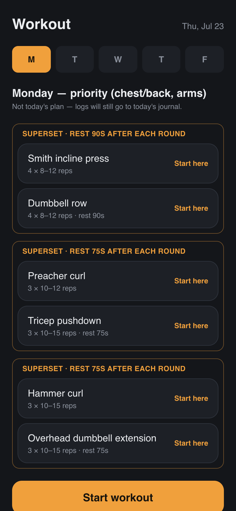
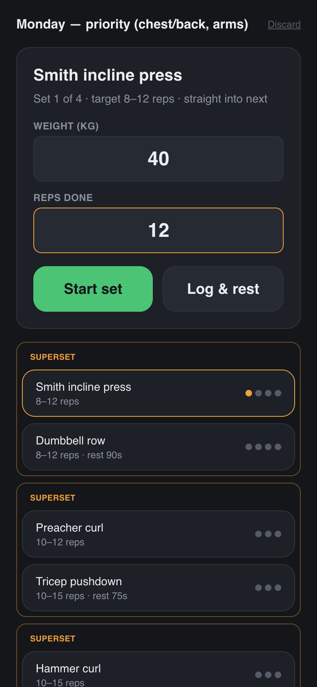
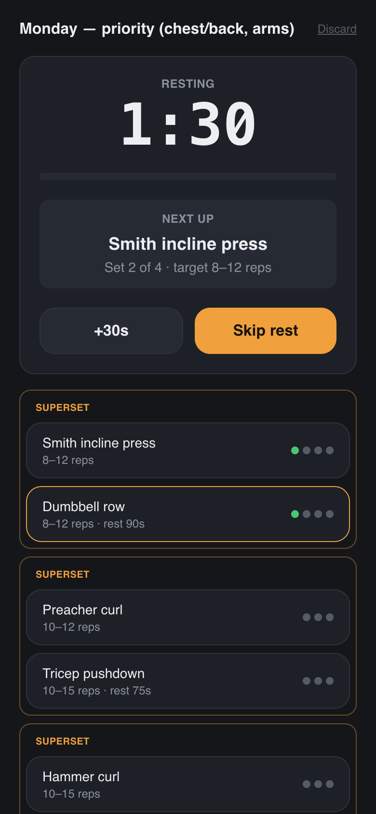
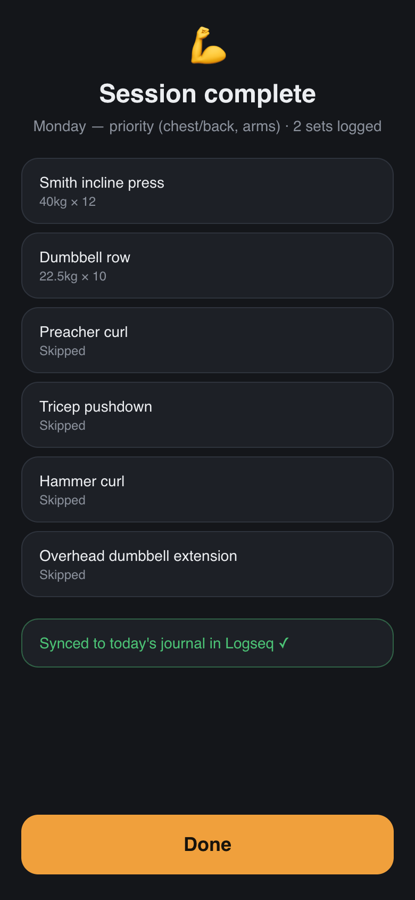

# logseq-workout-pwa

Mobile-first PWA that guides a gym or bodyweight session set by set — weight
and reps inputs, rest timer with sound/vibration, screen wake lock, superset
support — and appends each finished session to a dated workout note in an
Obsidian vault.

The repo name is from its Logseq days; the sidecar now writes plain markdown
files straight into the vault instead of shelling out to the `logseq` CLI.

## Screenshots

| Home | Logging a set |
|---|---|
|  |  |

| Rest timer | Session complete |
|---|---|
|  |  |

## What lands in Obsidian

Each finished session is written to
`<vault>/02 areas/Workouts/YYYY-MM-DD.md`. A new day gets a page with
frontmatter; a second session on the same day is appended below the first.

```markdown
---
title: "Oct 3rd, 2026"
created: "2026-10-03"
updated: "2026-10-03"
---

**Gym**

bench press:: 35kg/15, 35kg/12
pulldown:: 54kg/10, 54kg/8
shoulder press:: 20kg/10, 20kg/10
```

Each line is `exercise:: weight/reps` per completed set (just `reps` when no
weight was entered). Exercises with no completed sets are left out. The
`Progress.md` note in the same folder parses these lines with Dataview.

## Editing the workout plan

Both plans live in **`src/plan.ts`** — it is the only file to touch when the
programme changes. `PLANS` has a `gym` and a `bodyweight` plan, picked on the
home screen. Each plan has a `title` and a `groups` array; each group holds
one or more exercises:

```ts
{
  exercises: [
    { name: 'bench press', reps: '8–12', sets: 2, restSec: 150 },
    { name: 'pulldown', reps: '8–12', sets: 2, restSec: 150 },
  ],
},
```

- **One exercise** in a group is straight sets.
- **Two or more** is a superset, performed in alternating rounds
  (A set 1 → B set 1 → A set 2 → …). `restSec` is the rest after each set.

The session always writes to today's date. After editing, redeploy (see below)
and fully close/reopen the installed PWA twice to pick up the new version.

## Run (development)

```bash
bun install
bun run start   # sidecar (:12316) + Vite dev server (:5173)
```

Set `OBSIDIAN_VAULT` in `.env` (see `.env.example`). `ALLOWED_HOSTS` exposes
the dev server over LAN/VPN.

## Run (production / install on phone)

```bash
bun run build
bun run serve   # serves dist/ + API on :5175 (PORT to override)
```

Open the served URL on your phone and "Add to Home Screen". The logging flow
works fully offline; network is only needed when a finished session syncs.

Current deployment: `unraid@10.10.0.73:~/Documents/logseq-workout-pwa`,
running as the `logseq-workout.service` systemd user unit on **port 5176**,
published at `https://workout.pngs.cc` through a Cloudflare tunnel behind
Cloudflare Access. To ship changes: rsync the repo (excluding `node_modules`,
`dist`, `.git`, `.env`), then on the host run `bun install`,
`bunx tsc --noEmit -p tsconfig.app.json`, `bun run build` and
`systemctl --user restart logseq-workout.service`.

### Cloudflare Access sign-in

The installed app keeps working offline after the Access session expires, but
saves can't reach the server. When that happens a "Sign-in expired" bar
appears with a **Sign in again** link (`/logseq-cli/reauth`), which goes
through the Access login and returns to the app; queued workouts then save.

Builds older than this link can't recover by themselves, because the update
check is redirected too. Add a temporary Access Bypass policy for your home
IP, reopen the app twice on home Wi-Fi, then remove the policy. Don't delete
the home-screen app — that wipes any unsaved workouts in its storage.

## How it works

- `src/plan.ts` — the plans (see above).
- `src/lib/session.ts` — pure session state machine: start from any exercise,
  per-set logging, rest handling, round-robin superset advancement, jumping
  between exercises when a machine is busy, finish-early.
- Every state change mirrors to IndexedDB, so a refresh or backgrounding
  resumes mid-session. Last-used weight per exercise is prefilled.
- On completion the markdown block is queued in an IndexedDB outbox and
  flushed on launch, foreground, coming online and every 20s. Requests time
  out after 15s so a hung request can't block the queue. The completion
  screen only shows "Saved ✓" once the server confirms, and otherwise shows
  the last error with a Retry button.
- `sidecar/` — `GET /graph`, `GET /reauth`, and
  `POST /workout { page: "YYYY-MM-DD", content }`, which creates or appends
  to the day's note. Retries are deduped by exact content match, so a note
  never gets double entries.

## Checks

```bash
bun test    # session reducer, markdown builder, outbox, sidecar handler
bun run lint
bun run build
```
